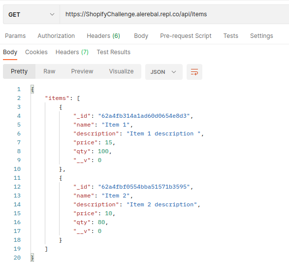
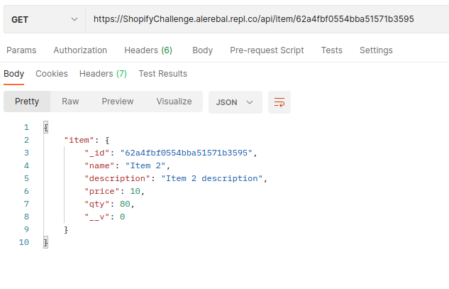
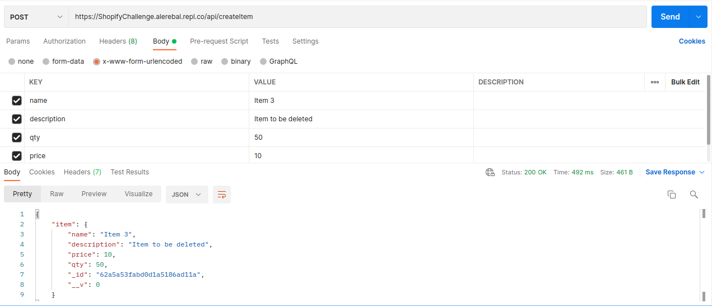
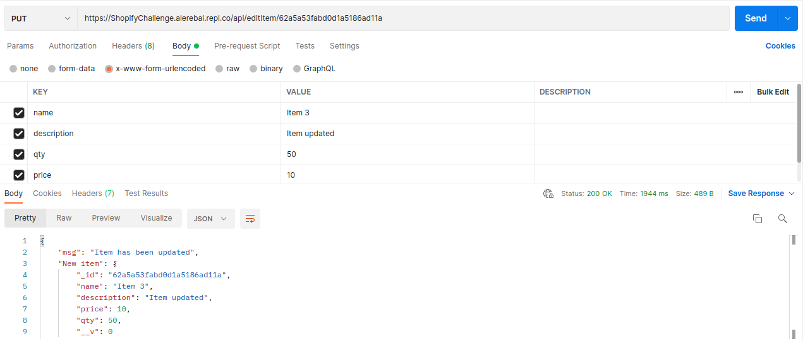
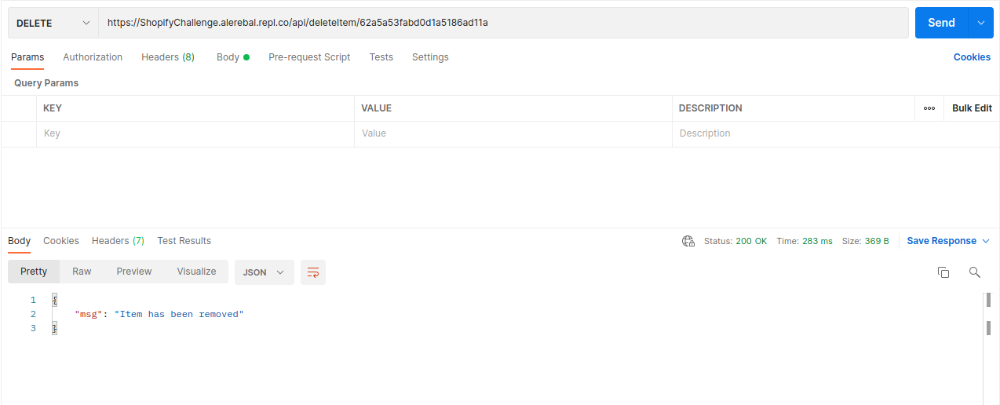
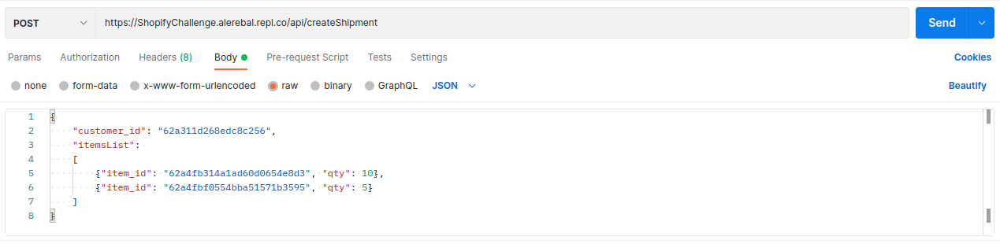
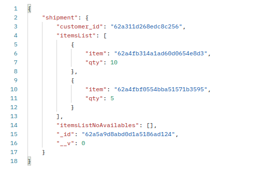
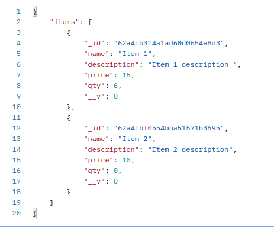
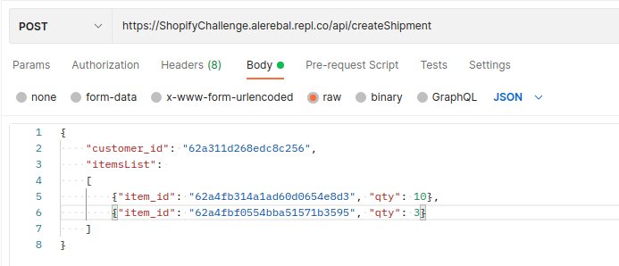
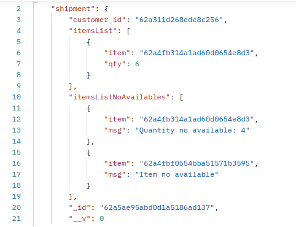

# Shopify Challenge

This is a Developer challenge I had to made for an intern position at Shopify, focus on high quality back-end code. The Project runs on Replit.

I had to build an inventory tracking web application for a logistics company, using the technology that I wanted. I used Javascript, NodeJs os environ, Express as framework, Mongodb as database and Mongoose as library. To test it I used Postman.

## The requirements

- Create a basic CRUD
  - Create inventory items
  - Edit Them
  - Delete Them
  - View a list of them
  
- Ability to create “shipments” and assign inventory to the shipment, and adjust inventory appropriately (There were other two options to implement a feature, we must choose one of them.)

## How it works

[Here is the Replit link were the app is runnig](https://replit.com/@Alerebal/ShopifyChallenge#.replit)

Once you are in Replit, press the green Run button.
When the app is running you can use [Postman](https://www.postman.com/) or any other method that you want to start to make requests. The app has not home page so a **cannot get /** will be display on the screen or in the page if you press the **Open website** link.

The url to make requests is:
    
    https://ShopifyChallenge.alerebal.repl.co/api/
    
### List of items

Method: Get

    https://ShopifyChallenge.alerebal.repl.co/api/items

### Get an item

Method: Get

    https://ShopifyChallenge.alerebal.repl.co/api/item/<item_id>

#### Replace item_id for any _id of the items shown previously or create a new one an use its _id

### Create an item

Method: Post

    https://ShopifyChallenge.alerebal.repl.co/api/createItem

#### Params must be sent by the Body, name and qty are required but qty has a default value of 0. Description and price are not required.

### Update an item

Method: Put

    https://ShopifyChallenge.alerebal.repl.co/api/editItem/<item_id>

#### Same way that to create an item. Here any param is not required.

### Delete an item

Method: Delete

    https://ShopifyChallenge.alerebal.repl.co/api/deleteItem/<item_id>

### Create a shipment

Method: Post

Body: Raw, application/JSON

    https://ShopifyChallenge.alerebal.repl.co/api/createShipment

#### Params itemsList is required, a list of objects, where item is a valid item_id and qty is any quantity you want. Customer id is a required param too, but it is just a string, not necesary to be a valid customer_id. 

When a shipment is created the stock is modificated. I created a helpers folder in where I defined a getItemQty function that checks if there are enough stock of an item to be delivered, and if the item can be delivered, I created the adjustInventory function to modify the stock.

If there are not enough quantity of the item, but there are some items, the item_id and the quantity left in the stock will be delivered and the quantity of item not delivered put into a item_no_availables list. If there is none item availables, the item_id and a message will be put into the same list.

#### The quantity of each items han been modificated, and the list of items no delivered filled with the according quantity.

